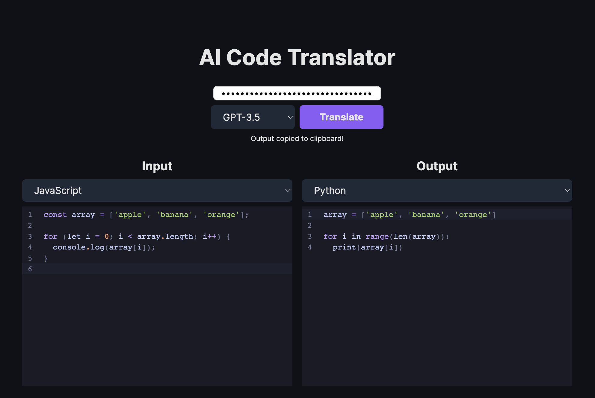

# AI Code Translator

An AI-powered code translation tool that converts code between programming languages using OpenAI's API. Built with Next.js and TypeScript.

Originally forked from [mckaywrigley/ai-code-translator](https://github.com/mckaywrigley/ai-code-translator).



## Features

- Translate code between 50+ programming languages
- Syntax highlighting with CodeMirror
- Real-time streaming translation
- Clean, responsive UI with Tailwind CSS

## Tech Stack

- Next.js
- TypeScript
- OpenAI API
- CodeMirror
- Tailwind CSS

## Getting Started

1. Clone the repo:
   ```bash
   git clone https://github.com/Sagargupta16/ai-code-translator.git
   cd ai-code-translator
   ```

2. Install dependencies:
   ```bash
   npm install
   ```

3. Set up environment variables:
   ```bash
   cp .env.local.example .env.local
   ```
   Add your OpenAI API key to `.env.local`.

4. Run the development server:
   ```bash
   npm run dev
   ```

5. Open [http://localhost:3000](http://localhost:3000).

## Environment Variables

See `.env.local.example` for required variables:
- `OPENAI_API_KEY` - Your OpenAI API key

## License

MIT
